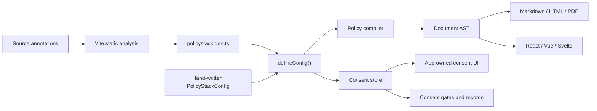

# PolicyStack v1: current state

> Research snapshot: 5 September 2026, `main` at [`ab60c44`](https://github.com/jamiedavenport/policystack/commit/ab60c44131087c2030b1d14ca4c6e336817335dd). All public packages are on the `1.5.0` release line. This document describes implemented behavior, not planned product copy.

## Overview

PolicyStack is AI-first, developer-friendly privacy infrastructure for TypeScript applications. It provides typed primitives rather than a finished compliance widget, giving developers control over the policy and consent surfaces while making those surfaces understandable to coding agents. Its central idea is that one `PolicyStackConfig` should describe what an application collects, why it collects it, which cookies and third parties it uses, and where it operates. That config then drives both sides of the privacy boundary:

- **Policy** compiles privacy and cookie policies into a renderer-neutral document tree.
- **Consent** derives a headless, jurisdiction-aware consent state machine from the same cookie declarations.

The project does not host policy content in an iframe and does not impose a banner design. Applications render the documents and build the consent UI with their own framework components. This is intended to avoid the visual compromise, runtime weight, and performance cost of a generic third-party cookie-banner product. The open-source packages are Apache-2.0; the separately described Cloud control plane is an early-access hosted product. See the [project overview](../README.md) and [Cloud status](../apps/web/content/pages/cloud.md).



## Goals of the framework

The current architecture expresses six practical goals:

1. **Give developers control of the consent surface.** PolicyStack supplies state, rules, and gates while the application owns its UI, copy, design system, accessibility, and loading strategy. The aim is a native, lightweight experience instead of a visually intrusive, performance-heavy banner SDK.
2. **Eliminate drift between behavior and disclosure.** Source annotations, a generated registry, shared config, validation, and consent scanning are intended to make application behavior and published policies match. Current static analysis is heuristic, so exact equivalence is the direction of travel rather than a guarantee.
3. **Make privacy practices reviewable as code.** Config changes can be typed, diffed, tested, and reviewed with the implementation that caused them.
4. **Catch problems before deployment.** Type constraints, runtime validation, source annotations, and Vite diagnostics move common omissions into development and CI.
5. **Make the framework usable by developers and coding agents.** Predictable types, stable diagnostic codes, generated references, skill files, structured CLI output, and MCP tools give both audiences a machine-readable surface. See the [SDK exports](../packages/sdk/src/index.ts) and [MCP tool registry](../packages/cli/src/mcp/tools.ts).
6. **Support progressive, self-hosted adoption.** Core APIs work without a UI framework; rendering, Vite scanning, vendor scripts, framework adapters, and agent tooling can be added independently.

## Core features

### 1. Typed policies as code

`defineConfig()` is the primary authoring boundary. Data categories and their legal context share the same keys, which lets TypeScript catch missing context for explicitly declared and scanned categories. Company identity and contact values should be supplied explicitly.

```ts
// policystack.ts
import { ContractPrerequisite, defineConfig, LegalBases } from "@policystack/sdk";

export default defineConfig({
	company: {
		name: "Acme",
		legalName: "Acme Ltd",
		address: "1 High Street, London",
		url: "https://acme.example",
		contact: { email: "privacy@acme.example" },
	},
	effectiveDate: "2026-09-05",
	jurisdictions: ["eea", "uk", "us-ca"],
	data: {
		collected: { Account: ["Name", "Email address"] },
		context: {
			Account: {
				purpose: "Create and operate an account",
				lawfulBasis: LegalBases.Contract,
				retention: "Until account deletion",
				provision: ContractPrerequisite("An account cannot be created without it."),
			},
		},
	},
	cookies: {
		used: { essential: true, analytics: true },
		context: {
			essential: { lawfulBasis: LegalBases.LegalObligation },
			analytics: { lawfulBasis: LegalBases.Consent },
		},
	},
});
```

The config supports company/DPO/EU-representative details, children, third parties, automated decision-making, tracking technologies, arbitrary data and cookie categories, explicit policy selection, and runtime consent options. User rights and the consent mechanism are derived rather than authored. The canonical shape lives in [core types](../packages/core/src/types.ts).

### 2. Policy compilation and output

The core compiler produces versioned `Document` AST values for privacy and cookie policies. `@policystack/renderers` converts that tree to Markdown, HTML, or PDF:

```ts
import { compilePolicy } from "@policystack/renderers";
import policy from "./policystack";

const files = await compilePolicy(policy, "privacy", {
	formats: ["markdown", "html", "pdf"],
});
```

React, Vue, and Svelte can instead render `<PrivacyPolicy />` and `<CookiePolicy />` directly. Their heading, paragraph, list, table, link, section, and root renderers are replaceable, so output can use an existing design system. PolicyStack boilerplate is available in English, French, German, Dutch, and Spanish, with optional dictionary overrides. See the [compiler](../packages/core/src/index.ts), [renderer API](../packages/renderers/src/index.ts), and [locale definitions](../packages/core/src/types.ts).

`defineConfig()` computes separate stable hashes for the privacy and cookie documents. A cookie-content change can therefore re-prompt consent without a privacy-only edit doing the same. Manual version strings remain supported. See [policy versioning](../packages/core/src/policy-version.ts).

### 3. Build-time collection and validation

The SDK provides runtime-no-op markers for data collection, sharing, third parties, and cookie categories. The Vite plugin extracts literal declarations and writes a commit-friendly `policystack.gen.ts`, which is passed back to `defineConfig()`:

```ts
import { collecting, thirdParty } from "@policystack/sdk";

thirdParty("PostHog", "Product analytics", "https://posthog.com/privacy");

await db.users.insert(collecting("Account", { email }, { email: "Email address" }));
```

```ts
// vite.config.ts
import { policyStack } from "@policystack/vite";

export default {
	plugins: [policyStack({ strict: true, consent: { mode: "error" } })],
};
```

The plugin also validates jurisdiction-dependent requirements, can promote warnings to build errors, supports committed suppressions by diagnostic code, and optionally detects ungated cookie/vendor usage. Detection covers common cookie APIs and a bundled tracking-vendor registry; custom scanner rules and vendors are supported. See [Vite options](../packages/vite/README.md), [markers](../packages/sdk/src/markers.ts), and [scanner rules](../packages/vite/src/consent/scan.ts).

### 4. Headless consent with framework bindings

`createConsentStore(config)` derives enabled categories from `cookies.used` and their locked/optional state from each lawful basis. It supports boolean expressions, staged preference edits, accept/reject actions, versioned records, cross-tab local-storage updates, GPC, jurisdiction posture, and re-prompt triggers for policy, category, expiry, or jurisdiction changes.

React, Vue, Svelte, Solid, and Angular expose native bindings over the same store. A React integration looks like this:

```tsx
import { ConsentGate, GatedScript, useConsent } from "@policystack/react/consent";
import { PolicyStack } from "@policystack/react/provider";
import { ga4 } from "@policystack/scripts/ga4";
import policy from "./policystack";

function Banner() {
	const { route, acceptAll, acceptNecessary } = useConsent();
	if (route !== "cookie") return null;
	return (
		<>
			<button onClick={acceptAll}>Accept all</button>
			<button onClick={acceptNecessary}>Necessary only</button>
		</>
	);
}

export function App() {
	return (
		<PolicyStack config={policy}>
			<Banner />
			<ConsentGate requires="analytics">
				<AnalyticsFeature />
			</ConsentGate>
			<GatedScript def={ga4({ measurementId: "G-XXXX" })} />
		</PolicyStack>
	);
}
```

Built-in storage adapters cover `localStorage`, cookies (including SSR header helpers), and a generic HTTP endpoint. Jurisdiction can be resolved manually, from common country headers, a client geo endpoint, or timezone. Unknown/unsupported countries fall back to the conservative `row` opt-in posture. See the [consent API](../packages/core/src/consent/index.ts), [store contract](../packages/core/src/consent/types.ts), and [jurisdiction resolvers](../packages/core/src/consent/jurisdiction.ts).

Seven script factories ship today: GA4, Google Tag Manager, Meta Pixel, PostHog, Segment, Hotjar, and Microsoft Clarity. Factories install queue stubs before consent and inject the vendor script once the required expression passes. See [`@policystack/scripts`](../packages/scripts/src/index.ts).

### 5. CLI and agent interfaces

The CLI currently implements:

```sh
policystack init               # install, scaffold, emit SDK reference and agent prompt
policystack validate --json    # machine-readable config diagnostics
policystack mcp                # stdio MCP server for coding agents
```

The MCP server exposes six tools: validate a config, scaffold one, explain a jurisdiction, list SDK presets, explain a diagnostic, and scan for ungated use. The SDK also generates its agent reference and three-skill pack from live runtime tables to reduce documentation drift. See the [CLI command registry](../packages/cli/src/index.ts) and [agent artifacts](../packages/sdk/src/llms.ts).

## Package and platform coverage

All packages publish under `@policystack/*` and version together.

| Area                                  | Current support                                        |
| ------------------------------------- | ------------------------------------------------------ |
| Public authoring                      | `sdk`                                                  |
| Compiler, AST, validation             | `core`                                                 |
| Consent runtime and storage           | `core/consent`                                         |
| Build integration and static scanning | `vite`                                                 |
| Document output                       | `renderers`: Markdown, HTML, PDF                       |
| Policy UI                             | React 18+, Vue 3.5+, Svelte 5                          |
| Consent UI bindings                   | React 18+, Vue 3.5+, Svelte 5, Solid 1.8+, Angular 20+ |
| Gated-script components               | React, Vue, Svelte, Solid                              |
| Vendor script definitions             | `scripts`: seven integrations                          |
| Setup and agent tooling               | `cli`: init, validate, MCP                             |
| Reference application                 | TanStack Start; Astro and Wasp examples also exist     |

The monorepo also contains the `policystack.dev` marketing/documentation application and an `openpolicy.sh` redirect shim. The package layout and development workflow are documented in [CONTRIBUTING.md](../CONTRIBUTING.md).

## Benefits and expected outcomes

- **Less policy drift:** changes to declared data, cookies, vendors, or jurisdictions flow through generated documents and consent configuration.
- **Earlier feedback:** type errors and stable diagnostic codes make many omissions actionable in editors, builds, CI, and agent loops.
- **Consistent consent semantics:** one core store powers every framework adapter; lawful basis determines whether a category is locked or consent-gated.
- **Audit-friendly changes:** configs, generated scan output, suppression decisions, and content-derived versions can live in version control.
- **A native, potentially lighter consent surface:** policies render locally and consent is headless, so teams avoid a third-party iframe/banner runtime and retain UI, loading, and hosting control.
- **Smaller adoption surface:** consumers can use only the core, output format, framework adapter, scanner, or vendor integrations they need.

These are engineering outcomes, not a guarantee of legal compliance. They depend on complete annotations, accurate configuration, appropriate UX, and legal review.

## Limitations and missing pieces

### Product boundaries

- PolicyStack generates **privacy and cookie policies only**. It does not generate terms of service, DPAs, records of processing, DPIAs, or open-source DSAR workflows.
- It is **not legal advice** and cannot determine which laws or disclosures apply to a business. Generated text should be reviewed by qualified counsel.
- Consent is intentionally **headless**. There is no ready-made banner or preferences UI, and accessibility/UX remain the adopter's responsibility.
- There is no open or self-hostable PolicyStack control plane. Hosted audit logs, analytics, policy registry, SSO/SCIM, and cross-app configuration are described under **Cloud**, which is in private beta/early access and is not implemented in this repository.

### Architecture and server-side limits

- PolicyStack is **TypeScript- and Vite-first**. The core JavaScript can be called elsewhere, but typed authoring, source markers, framework bindings, and automated scanning assume a TypeScript web application.
- The current model is effectively **one config plus one application source tree**. It has no native multi-repository discovery, service catalogue, schema ingestion, or aggregation protocol for a polyglot microservices estate.
- A Go service—or any non-TypeScript worker, data pipeline, or backend—cannot use the markers or Vite scanner. Its collection, sharing, and automated processing must be copied into the TypeScript policy config or integrated through custom tooling, which reintroduces drift risk.
- Server-side consent support stops at a generic JSON `serverAdapter` and cookie parsing/serialization helpers. PolicyStack does not supply server middleware, a database model, identity-to-consent association, service-to-service propagation, event streams, or enforcement SDKs for background jobs. An automated processing pipeline therefore cannot query or enforce a user's decision without application-specific storage and integration. See the [server adapter](../packages/core/src/consent/storage/server.ts) and [consent record](../packages/core/src/consent/types.ts).

### Policy-definition extensibility

- Policy structure and legal prose are hardcoded in core section builders. Consumers can change their factual config, override the translation dictionary, or replace rendered components, but they cannot declaratively add, remove, or reorder sections, change a jurisdiction's rights/rules, or register a new policy type.
- Supporting a materially different policy definition or jurisdiction currently requires changing or forking core. There is no public plugin contract for policy builders, compliance rules, or jurisdiction packs. See the [privacy builders](../packages/core/src/documents/privacy.ts), [cookie builders](../packages/core/src/documents/cookie.ts), and [dictionary contract](../packages/core/src/i18n/types.ts).

### AI and review limits

- AI support is an early tool surface, not an autonomous compliance system: generated `llms.txt`, three skills, structured CLI output, and six MCP tools.
- There is no built-in review agent that continuously audits a repository, reconciles policy changes across services, comments on pull requests, assesses legal sufficiency, proposes verified remediation, or manages human approval. The current tools help another coding agent inspect and edit a config; they do not perform independent compliance review.
- Agent-generated config remains only as good as the code and context the agent can see. Uninstrumented behavior, external systems, and incorrect legal assumptions are not discovered automatically.

### Coverage limits

- Only `eea`, `uk`, and `us-ca` have jurisdiction-specific policy text. Switzerland, Brazil, Canada, the US baseline, the other 49 US states, and rest-of-world use generic “equivalent” text and emit `jurisdiction-generic-policy-text`. See the [jurisdiction table](../packages/core/src/jurisdiction-id.ts).
- Built-in localization covers `en`, `fr`, `de`, `nl`, and `es`, and only translates PolicyStack-authored boilerplate. Company names, purposes, retention statements, and other supplied strings are not translated.
- Solid and Angular have consent bindings but no policy-document renderer. Angular also has no framework-native `GatedScript` wrapper.
- Solid's `1.5.0` package exports TypeScript source rather than compiled JavaScript, so consumers need a toolchain that transpiles dependency source. See the [Solid package manifest](../packages/solid/package.json).
- The vendor registry and seven script factories are useful defaults, not comprehensive coverage of third-party services.

### Detection and runtime limits

- Auto-collection and consent scanning are static AST analyses, not data-flow or control-flow proofs. The consent heuristic intentionally favors false negatives over false positives. Dynamic marker arguments are skipped, and unparsable files are skipped so the rest of a scan can continue. See the [scanner implementation](../packages/vite/src/consent/scan.ts) and [gating heuristic](../packages/vite/src/consent/ungated.ts).
- Policy extraction defaults to `.ts` and `.tsx`; other extensions require configuration. Dependency detection only recognizes the bundled registry.
- Static findings are advisory unless wired to a failing Vite mode. Runtime enforcement exists only where the application uses `ConsentGate`, `has()`, `gateScript()`, or equivalent framework bindings.
- Once a vendor script has loaded, revoking consent does not unload it or reverse effects it already produced. Applications must use vendor-specific opt-out/reset APIs where required. See the [React gated-script contract](../packages/react/src/gated-script.tsx).
- Country headers cannot identify a US state. State-specific posture requires the client geo resolver with a region, a manual resolver, or another custom resolver.

### Known implementation and documentation gaps

- Empty `data.collected` is a validator warning described as valid for a no-data site, but the privacy compiler currently throws when it is empty. Compare [validation](../packages/core/src/validate.ts) with the [privacy compiler](../packages/core/src/documents/privacy.ts).
- Website docs say `trackingTechnologies` alone auto-emits a cookie policy, but the current emission gate checks only for `cookies`. Compare [policy overview](../apps/web/content/docs/policy/policies/overview.md) with [`shouldEmit()`](../packages/core/src/emit.ts).
- Several SDK/site/CLI comments still say company fields are seeded from `package.json`. Current normalization does not read host metadata; omitted name/email normalize to empty strings and validation reports them. See [normalization](../packages/core/src/normalize.ts) and its [SDK regression test](../packages/sdk/src/index.test.ts).
- The published Vue `1.5.0` export map omits `./provider`, although the local source and docs describe `@policystack/vue/provider`. Direct policy rendering remains available, but documented shared-provider wiring is not importable from the published package. Compare the [Vue manifest](../packages/vue/package.json) with the [published metadata](https://registry.npmjs.org/@policystack%2fvue/latest).
- Consent-specific `policystack scan` and `policystack sync` shell commands remain planned. Ungated scanning is available through Vite, the scanner library, and the MCP `scan_ungated` tool.
- Some marketing copy describes automatic runtime cookie blocking and built-bundle scanning. The shipped implementation performs static source scanning and explicit runtime gating; it does not globally patch arbitrary cookie writes.
- The documented root `vp test` command does not currently apply the Solid and Svelte package Vite transforms correctly. Those five suites pass when run from their package directories, but the root orchestration reports them as failures.

## Maturity and maintenance

The public package line is stable and follows semver. The repository has package-level tests across the compiler, validators, consent behavior, storage, scanners, renderers, CLI/MCP, vendor scripts, and framework bindings. Recent v1 releases have addressed SSR snapshots, staged preference saving, vendor bootstrap ordering, storage-key migration, scanner aliases, custom category copy, Microsoft Clarity, and US-state GPC scope. Release details are recorded in the package [changelogs](../packages/core/CHANGELOG.md).

Research prioritized the checked-in source and tests, then reconciled them with the project website, GitHub repository state, and npm's published `1.5.0` metadata. Where prose and implementation differ, this document reports the implementation and calls out the mismatch above.
