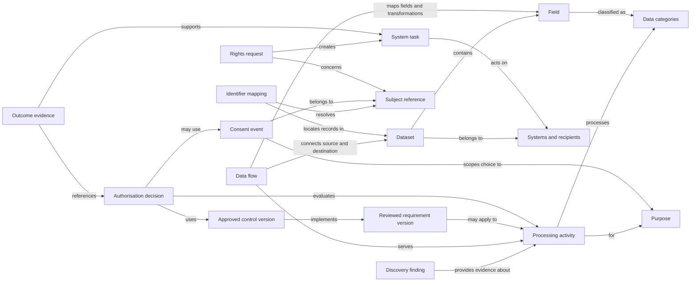
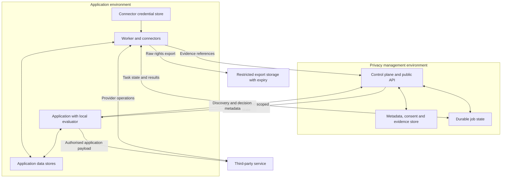

# PolicyStack v2: schema and code examples

These examples accompany the [v2 design decisions](./v2.md#technical-design). All schemas, identifiers, method names, and deployment shapes below are **illustrative proposals**, not implemented APIs or a migration contract. Code uses injected clients to explore behaviour without assigning new package names. Regulatory applicability and production failure semantics remain open.

## Shared data model

Processing activities connect inventory, consent, decisions, and downstream work. Datasets, fields, identities, and flows also have their own records; they are not merely labels on an activity. This diagram shows logical relationships, not database tables or a requirement to use a graph database. A requirement can apply through a basis other than consent.



## Schema examples

Examples use a fictional `example-analytics` recipient and a `product-analytics` purpose. IDs are scoped to an organisation; the authenticated installation supplies that scope. References must resolve within it. Opaque subject IDs can still be personal data and need access and retention controls.

### Application-model mapping

This YAML sketch maps an existing application table into the privacy inventory. It describes metadata and references to implementations, not a table migration or instructions to upload customer records. The table belongs to `app-db`; the existing `app-api` system accesses it.

```yaml
schemaVersion: v2-draft
dataset: app-db.users
system: app-db
kind: relational-table

subject:
  type: customer
  key: id
  identityNamespace: app-user

fields:
  id:
    categories: [account-reference]
  email:
    categories: [contact-email]
  date_of_birth:
    categories: [birth-date]
  organisation_id:
    relationship: app-db.organisations.id

processingActivities:
  - activity:account-management
  - activity:product-analytics

rights:
  locator: customer-records
  exporter: customer-export
  eraser: customer-erasure
```

The subject key resolves through the `app-user` namespace to a scoped subject reference such as `subject:7`. This is not an assumption that application IDs and subject references are interchangeable. A connector can perform that lookup locally. The `organisation_id` field is an application relationship, not the organisation boundary authorising access to PolicyStack records. Following a relationship must not automatically erase a shared organisation record.

The rights handlers need their own capability definitions and validation. Listing an activity here does not assign every field to it. In the analytics example, only the resolved account reference and a generated usage event are sent; email and date of birth are excluded.

### Dataset flow and field mapping

The backend constructs the event dataset from verified identity context and application behaviour. This flow records its transfer to the vendor's event store. Each named dataset has its own inventory record; `app-api.analytics-events` has `accountRef` and `event` fields classified as `account-reference` and `usage-event` respectively.

```yaml
schemaVersion: v2-draft
id: flow:analytics-delivery
activityId: activity:product-analytics
sourceDataset: app-api.analytics-events
destinationDataset: example-analytics.events
fieldMappings:
  - source: accountRef
    destination: accountRef
    transformation: copy
  - source: event
    destination: event
    transformation: copy
reviewStatus: pending
```

An additional derivation mapping would describe resolving `app-db.users.id` into the event's `accountRef` and generating its `event` field. Neither a copy nor a hash should be treated as proof of anonymisation. These mappings need version and provenance records so a field rename or changed transformation can trigger review while preserving the meaning of older evidence.

### Processing activity

This compact JSON Schema sketches a processing declaration. It deliberately leaves out full provenance, review history, applicability, and field-level mappings; those would be related records. Passing schema validation would establish record shape, not legal sufficiency or approval to process data.

```json
{
	"$schema": "https://json-schema.org/draft/2020-12/schema",
	"title": "Illustrative processing activity",
	"type": "object",
	"additionalProperties": false,
	"required": [
		"schemaVersion",
		"id",
		"purpose",
		"dataCategories",
		"sourceSystem",
		"recipient",
		"retentionRule",
		"reviewStatus"
	],
	"properties": {
		"schemaVersion": { "const": "v2-draft" },
		"id": { "type": "string", "minLength": 1 },
		"purpose": { "type": "string", "minLength": 1 },
		"dataCategories": {
			"type": "array",
			"minItems": 1,
			"uniqueItems": true,
			"items": { "type": "string", "minLength": 1 }
		},
		"sourceSystem": { "type": "string", "minLength": 1 },
		"recipient": { "type": "string", "minLength": 1 },
		"retentionRule": { "type": "string", "minLength": 1 },
		"reviewStatus": { "enum": ["draft", "pending", "approved", "rejected"] }
	}
}
```

A declaration matching that schema:

```json
{
	"schemaVersion": "v2-draft",
	"id": "activity:product-analytics",
	"purpose": "product-analytics",
	"dataCategories": ["account-reference", "usage-event"],
	"sourceSystem": "app-api",
	"recipient": "example-analytics",
	"retentionRule": "retention:analytics-events",
	"reviewStatus": "pending"
}
```

The pending declaration becomes eligible for publication only after review and approval. The examples below assume that publication has happened. `retentionRule` references a separately reviewed schedule; no retention period is implied here.

### Consent event

Consent is an ordered history of choices. The service assigns the revision and receipt time; the UI submits the user's choice through an authenticated or appropriately scoped session. A later withdrawal appends another event with `state: "withdrawn"` and a higher revision. Reading a historical grant alone is insufficient to authorise a current operation.

```json
{
	"schemaVersion": "v2-draft",
	"id": "consent-event:42",
	"subjectRef": "subject:7",
	"purpose": "product-analytics",
	"recipient": "example-analytics",
	"state": "granted",
	"revision": 42,
	"noticeVersion": "notice:analytics:3",
	"consentScopeVersion": "scope:analytics:2",
	"receivedAt": "2026-09-06T10:00:00Z",
	"source": "preferences",
	"evidenceRef": "evidence:consent-interaction:42"
}
```

This is an illustrative record shape, not a complete validation schema. It records a choice and its context; determining whether that choice satisfies the applicable requirements remains a separate responsibility.

`noticeVersion` identifies the document shown; `consentScopeVersion` identifies the processing terms covered by the choice. The service resolves their approved association when saving preferences. A reviewed wording-only publication may keep the same consent scope. If changed processing requires a new scope and renewed consent, the previous grant cannot authorise it merely because the purpose identifier is unchanged. Notification delivery is recorded separately from a user's choice.

### Decision request and result

The actor is the service performing the operation; the subject is the person whose data it concerns. The server derives both from trusted application context. Decision metadata contains categories and references rather than the raw payload.

```json
{
	"schemaVersion": "v2-draft",
	"requestId": "operation:123",
	"activityId": "activity:product-analytics",
	"actorRef": "service:app-api",
	"subjectRef": "subject:7",
	"action": "share",
	"purpose": "product-analytics",
	"dataCategories": ["account-reference", "usage-event"],
	"recipient": "example-analytics"
}
```

```json
{
	"schemaVersion": "v2-draft",
	"requestId": "operation:123",
	"decisionId": "decision:123",
	"effect": "allow",
	"reasons": ["activity-approved", "consent-granted"],
	"conditions": [],
	"ruleBundleVersion": "bundle:18",
	"consentRevision": 42,
	"evaluatedAt": "2026-09-06T10:00:02Z",
	"validUntil": "2026-09-06T10:00:07Z"
}
```

`validUntil` illustrates a policy-dependent freshness bound, not a proposed universal five-second window. A known revocation invalidates the decision sooner. The result applies only to the specified operation and inputs. How an evaluator establishes sufficiently current state, and when it requires an online check, remain design questions.

## Application code examples

### Frontend preferences

The injected `preferences` client binds requests to the current session and displayed notice. Saving does not load an analytics vendor. The application updates its UI only after the service accepts the choice; failures remain visible for retry. Withdrawal must also reach any already-running browser integration through its supported stop or opt-out mechanism.

```ts
// Proposed frontend client; not an existing PolicyStack export.
async function saveAnalyticsChoice(enabled: boolean) {
	const record = await preferences.save({
		purpose: "product-analytics",
		recipient: "example-analytics",
		state: enabled ? "granted" : "withdrawn",
		noticeVersion: "notice:analytics:3",
	});

	return record;
}
```

### TypeScript backend enforcement

The `privacy` client below binds the service identity and published rules at setup. `context.subjectRef` comes from verified application identity, and `context.operationId` is stable across retries of the same operation. Ordinary application access checks have already passed.

The proposed `run` helper evaluates immediately before invoking the callback, blocks denied or unknown decisions and stale required state, and refuses any conditions it cannot enforce. It durably records the decision and callback outcome for delivery to the control plane. Those are requirements for a future helper, not behaviour implemented today. Callback success establishes the observed provider response, not proof of all downstream processing.

```ts
// Injected privacy and analytics clients; proposed API sketch.
async function reportDashboardOpened(context: OperationContext) {
	const payload = {
		accountRef: context.subjectRef,
		event: "dashboard-opened",
	};

	return privacy.run(
		{
			schemaVersion: "v2-draft",
			requestId: context.operationId,
			activityId: "activity:product-analytics",
			actorRef: "service:app-api",
			subjectRef: context.subjectRef,
			action: "share",
			purpose: "product-analytics",
			dataCategories: ["account-reference", "usage-event"],
			recipient: "example-analytics",
		},
		() => analytics.send(payload, { idempotencyKey: context.operationId }),
	);
}
```

Payload values stay in the application's call to the vendor. The callback must send only the data described by the request; the evaluator cannot prove that an arbitrary callback matches its declaration. Instrumentation and review help detect mismatches. This fictional provider supports idempotency; unsupported providers need an explicit retry strategy.

### Python backend using the same contract

Python would use idiomatic methods over the same wire fields and decision semantics. This is an alternative implementation of the same operation, not another stage that sends the event twice. Go and other SDKs should conform to the same contract rather than translating rules independently.

```python
# Injected privacy and analytics clients; proposed API sketch.
async def report_dashboard_opened(context):
    async def send():
        return await analytics.send(
            {"accountRef": context.subject_ref, "event": "dashboard-opened"},
            idempotency_key=context.operation_id,
        )

    return await privacy.run(
        {
            "schemaVersion": "v2-draft",
            "requestId": context.operation_id,
            "activityId": "activity:product-analytics",
            "actorRef": "service:app-api",
            "subjectRef": context.subject_ref,
            "action": "share",
            "purpose": "product-analytics",
            "dataCategories": ["account-reference", "usage-event"],
            "recipient": "example-analytics",
        },
        send,
    )
```

## Connector schema and workflow code

A connector manifest describes supported operations and the strength of their evidence. Here deletion is asynchronous and confirmed only for the provider's live event store; backup deletion is a declared gap.

```json
{
	"schemaVersion": "v2-draft",
	"id": "connector:example-analytics",
	"systemRef": "example-analytics",
	"capabilities": {
		"locate": { "supported": true, "identifier": "accountRef" },
		"export": { "supported": true },
		"delete": {
			"supported": true,
			"completion": "poll",
			"idempotency": "provider-key",
			"evidenceScope": "live-event-store"
		},
		"propagatePreferences": { "supported": false }
	},
	"limitations": ["Provider cannot confirm deletion from backups"]
}
```

The worker persists returned state and schedules polling. It uses the same operation key when retrying submission after a crash; the fictional provider returns the existing job for that key. Credentials and provider-specific subject identifiers are resolved inside the connector's execution environment. This sketch assumes requester verification, identity mapping, and required review have already completed.

```python
# Invoked by a durable worker with persisted task state.
async def advance_deletion(task, provider):
    if task.provider_job_id is None:
        job = await provider.start_deletion(
            account_ref=task.provider_subject_ref,
            idempotency_key=task.operation_id,
        )
        return {"state": "pending", "providerJobId": job.id}

    result = await provider.deletion_status(task.provider_job_id)
    if result.state == "completed":
        return {
            "state": "confirmed",
            "evidenceRef": result.receipt_id,
            "evidenceScope": "live-event-store",
            "unresolvedScopes": ["backups"],
        }
    if result.state == "failed":
        return {"state": "needs-review", "reason": result.error_code}
    return {"state": "pending", "providerJobId": task.provider_job_id}
```

A confirmed connector task does not automatically complete the rights request. The workflow aggregates evidence, exceptions, and unresolved scopes across all relevant systems. Retryable transport errors are handled by the worker; retry limits and escalation remain to be designed.

## Customer-data journey

This design exercise joins the examples above. Assume the application mappings, flow, and processing activity have been reviewed and published before runtime use. The table describes linked records and transitions to validate, not a single aggregate status for a customer.

| Step                       | Records and relationships                                                                   | State and evidence                                                                                                                                                                                                 |
| -------------------------- | ------------------------------------------------------------------------------------------- | ------------------------------------------------------------------------------------------------------------------------------------------------------------------------------------------------------------------ |
| Create an account          | `app-db.users`, account-management activity, local identity mapping to `subject:7`          | Record the collection outcome against the reviewed activity and relevant controls; the customer record remains in the application database.                                                                        |
| Grant analytics consent    | Consent event `42`, `subject:7`, product-analytics purpose, recipient and notice version    | Append the grant and update the current consent projection. This choice alone does not approve the processing activity.                                                                                            |
| Share a usage event        | Analytics activity, dataset flow, decision `123`, bundle `18`, consent revision `42`        | Evaluate the specific event before sending it. Preserve the observed provider response separately from the allow decision.                                                                                         |
| Withdraw analytics consent | A new consent event at revision `43` for the same subject, purpose and recipient            | Update current state and propagate invalidation. Under the example's consent-dependent control, subsequent analytics sends are blocked once the withdrawal is known; freshness guarantees govern propagation gaps. |
| Request deletion           | Rights request linked to `subject:7`, requester verification, scope and reviewed exceptions | Resolve relevant application and vendor records through their mappings; create separate system tasks. Withdrawal itself is not evidence of deletion.                                                               |
| Perform deletion           | Application eraser and vendor connector tasks with stable operation keys                    | Persist pending provider jobs and completion evidence. The vendor example confirms only its live event store and leaves backups unresolved.                                                                        |
| Review the outcome         | Request linked to all task evidence, exceptions and remaining gaps                          | Communicate the confirmed scope and incomplete work. Request closure does not turn an unresolved scope into successful deletion.                                                                                   |

Validate that only fields mapped to analytics leave the application, identity lookup cannot cross organisation boundaries, and historical decisions still reference the correct rule and consent versions after withdrawal. Retention obligations and other processing purposes require their own assessment; withdrawing analytics consent does not implicitly remove every account record.

## Deployment and data boundaries

These are logical boundaries that can share one installation for a small project. Larger deployments can place workers and connectors inside application networks. The arrows indicate logical exchanges, not a requirement for inbound network connections to private systems.



Raw exports use a restricted storage path with a separate access policy and retention lifecycle. Routine inventory and decision events should not contain raw exports or connector credentials. Organisation isolation, worker authentication, rule authenticity, delivery guarantees, and the storage implementation still need concrete designs.
