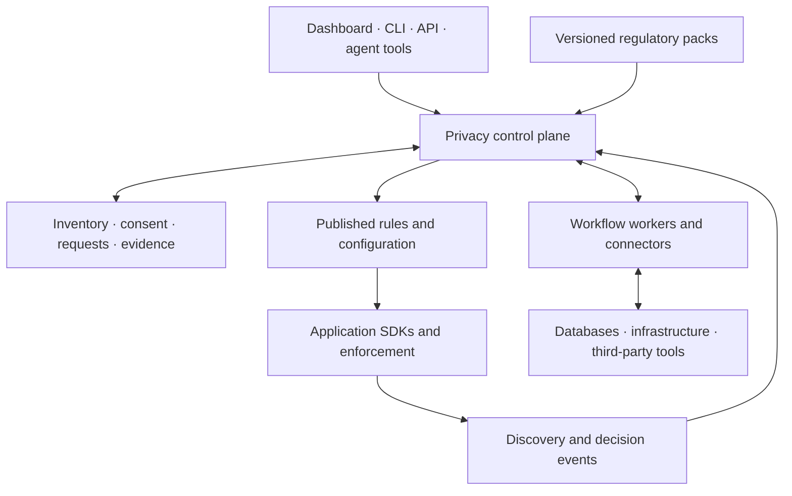
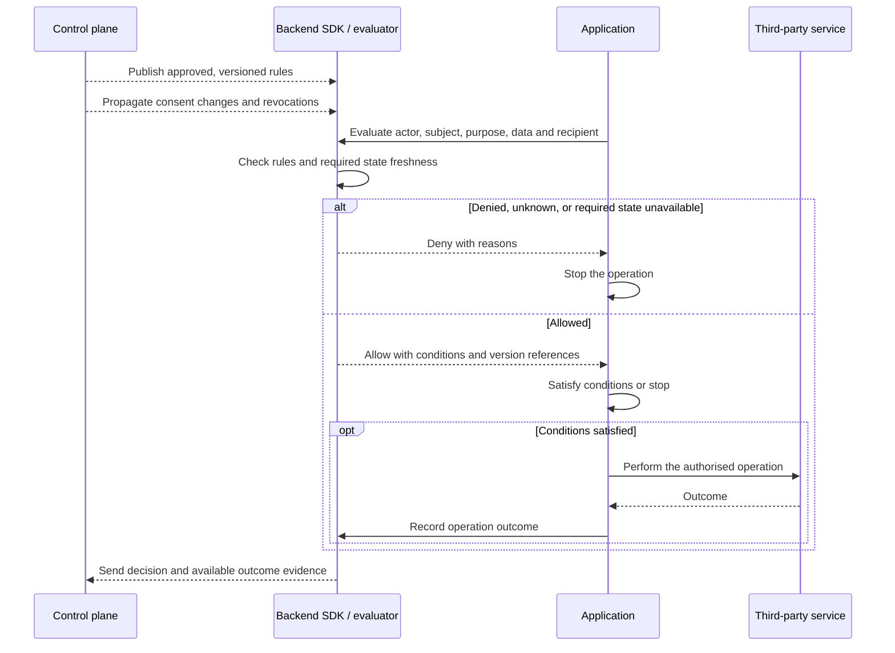
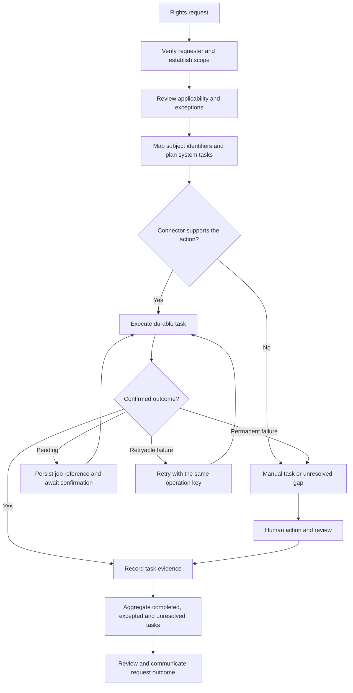

# PolicyStack v2: design decisions

> A working document for deciding what PolicyStack v2 should be. Accepted product directions are recorded in the decision log; implementation proposals remain exploratory and do not describe shipped functionality.

## Document status

> Record the owner, current phase, last review date, and links to any active proposals.

- **Status:** Product direction agreed; detailed design in progress
- **Owner:** TBD
- **Last updated:** 6 September 2026
- **Current-state reference:** [`v1.md`](./v1.md)

## Summary

The current direction is a self-hostable platform with accessible source that connects application instrumentation and third-party data flows with global regulatory requirements, consent, privacy enforcement, and data-subject rights. It integrates with application authentication and access controls. It should support frontend and backend applications across languages, including TypeScript, Python, and Go. The agreed licensing direction is permissive application SDKs and schemas with an ELv2 control plane, subject to legal and dependency review before adoption.

A shared privacy inventory should connect these capabilities: what data exists, whose data it is, where it goes, why it is processed, and which requirements and controls apply. The proposed operating loop is **discover → understand obligations → decide → enforce → fulfil rights → verify**, supported by retention controls, accurate notices, and audit evidence.

The proposed architecture is a central privacy control plane with distributed instrumentation and enforcement, starting with a modular monolith and workflow workers. Iterate on v1 wherever changes can remain compatible; use v2 for the substantial changes that require breaking public APIs. Declarative configuration and config as code are product requirements. Initial integration coverage will be shaped with design partners. Global published regulatory coverage is the ambition, with initial priorities guided by user populations and enforcement activity. The delivery sequence and rollout principles are agreed below; architecture, exact protocols, legal implementation of licensing, and regulatory-content governance remain open.

## Starting point

V1 already provides typed config, privacy and cookie policy generation, headless consent, framework bindings, static discovery, and CI diagnostics. Its main limits for this direction are the single-application TypeScript model, hardcoded regulatory content, and the absence of a self-hostable control plane and distributed backend enforcement. See [v1 current state](./v1.md).

## Why v2?

Improve v1 incrementally where possible. The broader privacy model and distributed APIs are substantial changes and are likely to require a major version. A v2 release should identify its actual breaking contracts and migration path; the ambition alone does not require replacing every existing package or delaying compatible improvements.

## Vision and principles

> Define what PolicyStack should become, who it should serve, and the principles that should guide tradeoffs. Note which v1 principles still apply and which need reconsideration.

## Scope

> Describe the intended outcomes and broad capabilities of v2. Record goals, non-goals, product boundaries, and the relationship between the open-source project and any hosted product without assuming a particular implementation.

### Goals

Build the leading self-hostable privacy and data-protection platform: simple enough for a hobby project and capable enough for a large, regulated organisation.

1. **Accessible and sovereign.** Keep product capabilities available for self-hosting, with teams in control of their configuration, privacy records, and operational data. Any future hosted offering should run the same software available to users. Use permissive terms for application SDKs and schemas and pursue ELv2 for the control plane, subject to legal review. This replaces the original all-open-source goal with an explicit open-source/source-available boundary; see licensing below.
2. **End-to-end.** Cover the full privacy lifecycle: discovery, inventory, applicable requirements, policies, consent and preferences, authorisation and enforcement, retention and deletion, data-subject rights, audit evidence, and drift detection.
3. **Language-neutral.** Support polyglot, distributed systems through open schemas and protocols, with idiomatic integrations for languages and frameworks rather than a TypeScript-only model.
4. **Progressively adoptable.** Provide a simple path for small projects and a scalable, governed path for complex and regulated organisations without forcing either experience onto the other.
5. **Verifiable and trustworthy.** Make provenance, uncertainty, rule versions, legal review, human approval, and accepted gaps explicit rather than implying that generated output guarantees compliance.
6. **Extensible.** Enable an open ecosystem of jurisdiction packs, integrations, discovery sources, storage and enforcement adapters, and workflows without requiring every capability to live in the core project.
7. **Declarative and auditable.** Make privacy configuration reviewable as code, with traceability from a proposed change through approval, publication, activation, and operational evidence.

### Non-goals

PolicyStack does not provide application authentication. General application access control belongs to the application's existing systems; PolicyStack's decisions concern privacy requirements. The exact integration contract still needs design.

### Users and use cases

### Product boundaries

The ambition is awareness of anywhere data goes, including third-party tools and services. Coverage must be explicit: distinguish instrumented and verified flows from declared, inferred, or unknown behaviour. Limited vendor APIs and processing outside instrumented applications must remain visible as gaps.

PolicyStack consumes trusted identity context from the application's authentication system and composes privacy decisions with existing access controls. A privacy allow decision does not grant application access. Initial application, discovery, and vendor coverage remains undecided and should be selected with design partners.

## Design partners and sponsors

> Define how design partners and sponsors will help shape, validate, and sustain v2. Cover the kinds of partners needed, the problems and environments they bring, the working relationship, mutual commitments, and the path from early collaboration to real-world adoption.

### What we need from partners

Use design partners to select initial environments, integrations, and workflows. Ask for representative data journeys, current consent and policy workflows, identity and schema complications, operational constraints, and access to reviewers who can validate regulatory interpretations. The first implementation should exercise one real journey end to end before expanding the integration catalogue.

### What partners receive

> Clarify the access, influence, support, recognition, and other benefits offered to design partners or sponsors without promising private product capabilities.

### Participation, influence, and transparency

> Decide how partner input affects priorities and decisions while preserving project independence, open development, confidentiality where necessary, and fairness to the wider community.

## Legal, licensing, and governance

> Revisit the legal and organisational foundations of the project before design choices make them difficult to change.

### Does the current licence still hold?

**Accepted direction:** allow commercial adoption in customer applications and retain permissive application SDKs and schemas. Pursue Elastic License 2.0 for the control plane to restrict third-party hosted or managed access to its substantial functionality, subject to legal and dependency review before adoption. PolicyStack may charge for its own Cloud service. This targets third-party service provision rather than prohibiting all profit-making use; the exact component boundary and any additional commercial permissions still need review.

A permissive open-source licence cannot prohibit commercial use. The [Open Source Definition](https://opensource.org/osd) requires commercial-use freedom and free redistribution. The alternatives considered were:

| Option                                                                            | Fit and limitation                                                                                                                                                                                                             |
| --------------------------------------------------------------------------------- | ------------------------------------------------------------------------------------------------------------------------------------------------------------------------------------------------------------------------------ |
| Keep Apache-2.0                                                                   | Permissive and compatible with charging for our hosting, but also permits commercial reuse by others subject to its terms.                                                                                                     |
| AGPL-3.0                                                                          | Open-source copyleft with source-sharing requirements, including for modified network-served software. It allows charging and competing hosting; it does not meet a prohibition on commercialisation.                          |
| Source-available licence restricting hosted services, such as Elastic License 2.0 | Selected direction for the control plane, subject to review: ELv2 restricts hosted or managed access to substantial software functionality. It is not a blanket ban on profit or resale and is not an OSI open-source licence. |

See the primary texts for [Apache-2.0](https://www.apache.org/licenses/LICENSE-2.0), [AGPL-3.0](https://opensource.org/license/agpl-3.0), and [ELv2](https://www.elastic.co/licensing/elastic-license), plus [Elastic's usage examples](https://www.elastic.co/licensing/elastic-license/faq). The agreed split deliberately leaves SDKs commercially reusable. Review shared-code dependencies so control-plane terms do not inadvertently apply to application SDKs.

Existing Apache-2.0 grants are irrevocable subject to their terms; a new licence cannot withdraw those permissions for already-released code. Before selecting future terms or a separate commercial licence, review copyright ownership, contributions, dependency compatibility, and the intended permissions with counsel. This document records a future licensing direction; the repository licence and existing package licence declarations remain Apache-2.0 until a separate, reviewed licensing change is made.

### What is covered?

> Clarify how code, generated policy content, documentation, translations, schemas, datasets, extensions, contributions, and hosted services are licensed or otherwise governed.

### Ownership and decision-making

> Decide how intellectual property, contributions, the PolicyStack name, stewardship, and authority over product, technical, legal-content, and release decisions should work.

## Product design

> Describe the experience and capabilities v2 needs before choosing its architecture. For each theme, consider what should remain, change, be added, or be removed relative to v1.

### Declarative configuration and config as code

**Accepted direction:** declarative config and config as code are core product capabilities, with a comprehensive audit trail. Author processing activities, mappings, pack references, organisational rules, retention, and runtime profiles in versioned files. Preserve typed TypeScript authoring and compile it to a canonical, language-neutral declaration; the concrete format remains to be chosen. Keep secrets and individual consent events out of source control.

Pin regulatory-pack versions and resolve customer extensions explicitly. Produce a deterministic snapshot and semantic change plan showing affected processing, notices, consent scopes, controls, and required reviews. Record the source revision, resolved inputs, compiler version, snapshot digest, reviewer, approval, and deployment target. Editing a file to say `approved` must not create an approval; that is an authenticated audit event bound to the exact snapshot.

Git records intended configuration. A separate operational history records approvals, publications, activation acknowledgements, consent changes, decisions, and outcomes. Correlate the two without claiming that a commit proves a deployment or that deployed configuration proves enforcement. Define access, retention, and tamper detection for that history.

For Git-managed configuration, dashboard and agent edits should propose changes through the same review path. The dashboard can support legal reviewers without requiring them to edit source files. Emergency changes should create an attributable, time-limited override and a reconciliation task; silent divergence between the dashboard and repository is unacceptable. Non-Git authoring, conflict handling, and emergency-override permissions remain design questions.

### Policy definition and generation

Connect policy and notice generation to the reviewed inventory, applicable requirements, and implemented controls. Support customisation, human review, versioning, rendering, and publication history. Identify discrepancies when actual processing changes so teams can update notices and controls together.

Generate documents from an approved snapshot of processing activities, dataset flows, recipients, retention rules, and applicable requirements, with reviewed custom text where needed. Link each publication to that snapshot so teams can trace disclosures back to their supporting facts. Compare application declarations and observations against it, exposing new destinations, changed data use, and missing controls as review findings. Development and CI checks should support blocking releases on configured findings; runtime discovery should surface drift within its observed coverage.

#### Policy changes, notifications, and renewed consent

Assess each proposed change against the previous publication and its underlying processing snapshot. Record the affected activities, purposes, recipients, notices, and consent scopes, together with a reviewed response: publication only, user notification, a renewed consent choice, or a combination. A wording-only edit should not automatically invalidate every consent record; changes to processing need their own assessment.

Model document versions separately from the version of processing terms a consent choice covers. Preserve the notice shown when a choice was made, and explicitly determine whether an existing choice remains valid for a proposed processing version. Where a new choice is required, keep the changed processing blocked until that choice is recorded; unaffected processing can continue under its existing controls.

Notifications need audience selection, channel adapters, delivery and retry state, and evidence of which publication was communicated. Notification delivery is not consent. Coordinate policy publication, rule activation, and consent prompts so newly enabled behaviour does not run ahead of the required notice or choice.

**Accepted rollout principles:** draft → validate and assess impact → approve exact snapshot → stage compatible application code and rules → publish required notices and collect required choices → activate eligible processing → verify. Eligibility is per processing scope and subject where needed; an organisation-wide rollout does not imply every subject has consented. Record effective dates and activation acknowledgements per environment and consumer so partial rollout is visible. Changed inputs invalidate the previous approval; incompatible consumers must not activate a bundle.

Rollback should publish a new audited activation of a compatible prior configuration, evaluated against current consent and revocations. It must not restore withdrawn choices, erase history, undo completed deletion, or assume a previously valid legal interpretation still applies. The exact state machine, delivery adapters, and activation protocol remain to be designed.

### Privacy inventory and discovery

Maintain a shared model of data categories, data subjects, processing purposes, storage locations, recipients, retention, and flows between systems. Combine frontend and backend instrumentation with infrastructure discovery, third-party integrations, and human declarations.

Preserve provenance and distinguish observed facts, declarations, inferences, and human-reviewed information. Show uncertainty and coverage gaps rather than treating the inventory as automatically complete.

### Consent, authorisation, and enforcement

Track consent and preferences over time, including collection, changes, withdrawal, propagation, and evidence. Provide privacy decisions that can account for purpose, trusted identity context, organisational policy, and applicable requirements, with consent as one input to the decision. Application authentication and general access controls remain external.

Connect decisions to enforcement at collection, access, sharing, exports, and background processing. Define how controls and preference changes reach distributed applications and third parties, and how unsupported enforcement is reported.

Retain cookie consent and headless preferences as explicit product capabilities. Provide guards for cookie and browser-storage access, vendor script loading, library initialisation, and subsequent data-sending calls, with framework bindings over shared semantics. Guarded initialisation should avoid duplicate startup and prevent controlled collection or transmission before the required choice. Server-side operations must enforce their own requirements using trusted consent state.

On withdrawal, stop future guarded operations and invoke supported library or vendor teardown, reset, or opt-out mechanisms. Removing a script element alone cannot undo an initialised library or its prior effects. Integrations must state which lifecycle actions they support; arbitrary uninstrumented library behaviour remains a coverage gap. Consent prompts and guards must also respond to policy changes that require a renewed choice, as described above.

### Retention and deletion

Treat retention and deletion as lifecycle controls that operate independently of user requests. Support schedules, reviewed exceptions, coordinated deletion across connected systems, and evidence of completion. Make incomplete actions and systems that cannot confirm deletion visible.

### Data-subject rights and entitlements

Support data-subject access requests (DSARs) and other applicable user entitlements through operational workflows. Cover requester verification, locating records across applications and vendors, coordinating actions, human review, exceptions, deadlines, and completion evidence.

Identity mapping across systems is a prerequisite for locating relevant records and fulfilling requests accurately. Track partial fulfilment and unresolved dependencies explicitly.

### Legal and jurisdiction coverage

Build a comprehensive database of global data-protection regulations, with explicit coverage and gaps. Connect source material to versioned requirements and applicability rules so teams can understand which obligations apply to a processing activity and what remains unresolved.

Record source provenance, effective dates, reviewed interpretations, and review status. Define how regulatory changes are maintained, legally reviewed, and translated into updates to policies, controls, and workflows. The accepted ambition is a comprehensive published global rule set. Prioritise initial jurisdictions by affected user populations and regulatory enforcement activity, informed by design partners and current evidence; the actual jurisdiction list and maintenance model remain undecided. Distinguish published source coverage, reviewed requirements, and executable control coverage.

Customers and their legal teams must be able to extend the rule system. The agreed direction is versioned, namespaced customer packs with pinned upstream dependencies, provenance, review, and explicit conflict reporting. Additions and stricter organisational controls should compose predictably; departures from a published interpretation need a visible, reviewed assessment rather than silently replacing its source. Rule precedence, conflict resolution, executable extension boundaries, and maintainer responsibilities still need design.

### Accountability and ongoing assurance

Record decisions, reviews, approvals, exceptions, and evidence. Detect drift between the reviewed inventory and actual behaviour, and identify affected requirements, policies, and controls. For example, a new analytics destination should prompt review of the recipient, purpose, notice, and relevant enforcement.

### User, developer, and agent experience

> Cover the main workflows and interfaces for end users, developers, reviewers, teams, and coding agents, including where human judgement remains necessary.

### Ecosystem and integrations

Support instrumentation across frontend and backend applications, including TypeScript, Python, Go, and other languages, through open contracts and idiomatic integrations.

Treat third-party tools and services as part of the privacy lifecycle wherever they receive, store, or process data. Integrations should expose their supported discovery, consent propagation, enforcement, rights fulfilment, and deletion capabilities, along with limitations and evidence available from the provider.

## Technical design

> Record the technical model only as product requirements become clear. Cover system boundaries, data and trust flows, public contracts, extensibility, packaging, and important alternatives without prematurely fixing the implementation.

See [v2 schema and code examples](./v2-examples.md) for application-model mappings, a customer-data journey, illustrative processing, consent, decision, and connector contracts, frontend and backend code, and deployment and data-model diagrams. These examples explore the proposed design; they do not describe APIs available in v1.

### Concepts and data model

Distinguish the **application's data model** from **PolicyStack's privacy model**, connected through explicit mappings. Applications should keep their existing tables, documents, events, files, and third-party objects. PolicyStack describes their privacy meaning and relationships without requiring a replacement ORM or copying their records into the control plane.

A **processing activity** connects an actor, particular data, a purpose, systems, recipients, and retention rules. It is a central connection point, while datasets, fields, identities, and data flows are first-class entities in their own right.

Discovery supplies evidence about an activity; regulatory rules identify potentially applicable requirements; consent and authorisation govern specific operations; rights and retention workflows act on the data. Each fact needs provenance and review status. An observed outbound request should create a discovery finding rather than automatically becoming an approved processing activity.

#### Application-model mappings

Map datasets and fields to data categories, subject types and identity namespaces, record relationships, and the processing activities that use them. Discover structural information from database schemas, ORM definitions, event schemas, and vendor APIs; let developers and reviewers supply and approve meanings that discovery cannot establish.

Field classification describes what data represents. Purpose, applicability, and consent requirements depend on the operation: an email address does not have one universal purpose or consent requirement. Associating a dataset with several activities does not imply that every field is used by each activity; field-level usage and flow mappings must capture the actual subset.

Rights mappings reference implementations that locate, export, and erase relevant records, including related records where appropriate. A declaration does not establish that these operations are supported or correct. Identity mappings should support resolution inside connectors, using scoped identifiers without centralising every email address or vendor identifier.

**Accepted identity direction:** use opaque subject references scoped by organisation and identity namespace, with environment boundaries enforced explicitly. Connectors resolve references to local account and vendor identifiers. Applications supply trusted actor and subject context from their existing authentication system; PolicyStack does not issue application identities. Anonymous browser identities can have a separate namespace. Linking them to accounts, merging accounts, and splitting mistaken links require explicit, audited operations; do not infer identity from matching emails or automatically combine consent grants across linked identities. Opaque identifiers can still be personal data.

**Accepted inventory direction:** start with explicit dataset, field, activity, and flow declarations, then add discovery as proposed changes. Give entities stable identifiers independent of display names and schema paths. Version field mappings and transformations so renames and derived datasets remain traceable. Model subject roles and shared-record relationships explicitly; a deletion request must not blindly traverse every relationship or erase another person's data. Before freezing the mapping contracts, validate them against a partner's anonymous-to-account journey, account merge, shared record, and vendor deletion. The mapping schema and linking permissions remain open.

#### Privacy domain entities

| Area                      | Core entities                                                                                      | What they establish                                                  |
| ------------------------- | -------------------------------------------------------------------------------------------------- | -------------------------------------------------------------------- |
| Organisation and systems  | Organisation, environment, system, connector installation                                          | Ownership, isolation, and where processing happens                   |
| Data inventory            | Dataset, field, data category, subject type, relationship                                          | What data exists and how records connect                             |
| Processing                | Activity, purpose, data flow, recipient, retention rule                                            | How and why data moves or is used                                    |
| Regulatory knowledge      | Source, requirement version, applicability assessment                                              | Potential obligations and reviewed applicability                     |
| Controls and transparency | Control version, rule bundle, review, publication, notice version, change assessment, notification | What has been approved, what changed, and what has been communicated |
| Identity and choices      | Subject reference, identifier mapping, consent event, preference                                   | Whose data and choices an operation concerns                         |
| Runtime evidence          | Discovery observation, decision, operation outcome                                                 | What was observed, permitted, and performed                          |
| Rights workflows          | Request, verification, system task, exception, evidence                                            | What must happen and what actually completed                         |

A **data flow** connects source and destination datasets, identifies the fields or categories involved, and references the processing activity. Record transformations such as copying, aggregation, and hashing explicitly; describing a transformation does not establish that its output is anonymous. Deletion is a lifecycle operation whose outcome changes what remains in a dataset, with evidence of the affected scope.

#### Persistence and history

The proposed starting point is a relational source of truth with explicit relationships and versioned records. The inventory is logically a graph, but that alone does not require a graph database. This favours referential integrity and transactional updates; graph traversal and high-volume observation workloads need validation before selecting storage technologies.

Keep three distinctions explicit:

- **Observed and approved:** discovery observations remain separate from reviewed inventory, with links showing which evidence supports each version.
- **Historical and current:** consent events and published control versions preserve history; projections provide efficient reads of current state. Decisions reference the versions and state revisions used at evaluation time.
- **Decisions and outcomes:** permission to share or delete remains separate from evidence that the operation happened and the scope confirmed by that evidence.

Scope records and references to the owning organisation and, where relevant, environment and identity namespace. Store schema metadata and scoped identifiers by default, with connector-local resolution for application records. Historical records remain subject to defined retention and access policies; preserving history does not imply retaining personal data indefinitely.

### Architecture and boundaries

The current proposal is a central privacy control plane with instrumentation and enforcement distributed across applications and third-party integrations. Start the control plane as a modular monolith with workers for discovery and long-running workflows. This keeps the initial deployment manageable while leaving room to scale workers and ingestion independently. Implementation language, database, workflow engine, and deployment technologies remain undecided.

#### Control plane and local enforcement

The control plane owns configuration, the privacy inventory, regulatory content, reviews, and evidence. Applications receive versioned rules and configuration, with local evaluation preferred for common backend operations to reduce latency and dependence on central-service availability.

A decision request asks whether an actor may perform an operation on particular data categories, for a purpose, with a given recipient and context. The result should include an allow/deny decision, reasons, and any required conditions. The application must enforce the result and any conditions; evaluating a rule alone does not enforce it. Privacy decisions compose with existing application access controls and do not replace them.

Local evaluation introduces consistency tradeoffs for current consent, revocations, and other changing state. The accepted requirement is a sensible default runtime profile with user configuration. Exact freshness bounds, update propagation, and failure behaviour still need validation. Frontend controls complement backend enforcement; servers must independently enforce their own operations.

**Accepted default principles:** block consent-dependent operations when a required choice is missing, withdrawn, or cannot be established within the configured freshness bound. Apply known withdrawals immediately in the evaluator and stop future supported guarded operations. A changed processing scope requiring renewed consent remains blocked under the old grant. Evaluate operations based on other approved grounds under their own requirements rather than making every operation depend on consent.

Configure freshness bounds, online-check requirements, timeouts, retry limits, and evidence delivery per activity or operation class, with versioned defaults and an explicit impact assessment for overrides. Configuration is not evidence that an override is legally appropriate. A transport failure must not silently become a consent grant. Propose durable asynchronous evidence delivery by default; define whether to block or continue with a recorded gap when evidence cannot be persisted, and allow stronger profiles to require durable evidence before proceeding. Exact numerical defaults and permitted failure modes remain open.

The proposed runtime flow separates asynchronous rule distribution and observation from the operation being authorised. Consent state may be cached or fetched according to the operation's freshness requirements; a rule bundle alone is insufficient.

This example illustrates the agreed conservative default when required state is unavailable. The precise configurable failure profiles remain open. Evidence delivery and retry semantics also need design: a decision, an attempted call, and confirmed downstream processing are different facts.

#### Durable workflows

DSARs, deletion, discovery scans, and regulatory updates need persistent jobs with retries, progress tracking, human review, and evidence. Workers coordinate actions across systems and retain their outcomes. Workflows must distinguish confirmed completion from an attempted action, partial fulfilment, or a manual task awaiting evidence.

Each system task has its own state. Human review can record an exception or unresolved gap without marking data deleted. Request closure and successful fulfilment must remain distinct outcomes.

#### Regulatory knowledge and executable controls

Keep three layers distinct: source material and reviewed interpretations; structured requirements and applicability rules; and executable organisational controls. A regulatory-content update should trigger impact assessment and review before changing production behaviour. Preserve the relationship between the source, interpretation, requirement version, approved control, and resulting decision.

### Public APIs and formats

Define language-neutral, versioned schemas and protocols for processing declarations, consent records, decision requests and results, discovery and decision events, published rules, and connector capabilities. Dashboard, CLI, and agent interfaces should use the same public application APIs.

Provide idiomatic SDKs for TypeScript, Python, Go, and other languages. Separate declaration and observation, consent and preference handling, and decision evaluation and enforcement so teams can adopt them independently. Automatic instrumentation can identify destinations and operations; developers or reviewers still need to supply meaning such as purpose.

Rule semantics must produce consistent decisions across implementations. The evaluation strategy and compatibility rules for evolving contracts remain to be selected and validated.

### Extensibility and integrations

Connectors should advertise specific capabilities such as discovery, record location, export, deletion, and preference propagation, together with their limitations and available completion evidence. Workflow planning should use these capabilities to identify automated actions, manual tasks, and unsupported steps.

Allow connectors and workers to run inside private networks so integrations can reach local systems without requiring those systems to be publicly accessible. Regulatory packs should be versioned inputs to the review and publication process.

### Packages and distribution

For small projects, aim for one self-hosted installation with one database, bundled workers, and an application SDK. Larger deployments should be able to separate workers, scale event ingestion, and place connectors near the systems they access. Both paths should use the same product and contracts; any hosted offering should run the same software.

Package boundaries and infrastructure choices remain open. The modular monolith is the proposed starting point, with deployment separation driven by demonstrated operational needs.

## Trust, quality, and operations

> Define what confidence users need in v2 and how it will be earned. Consider correctness, legal review, security, privacy, accessibility, performance, reliability, observability, testing, and ongoing ownership.

The proposed control plane should primarily hold metadata and evidence, minimising the personal data collected by instrumentation. These records can themselves be sensitive and need appropriate access and retention controls. DSAR exports and other raw personal data should use a separate, tightly controlled storage path with limited retention. Storage location, access boundaries, and evidence retention remain design questions.

## Compatibility and migration

Keep compatible improvements on v1; reserve changed public contracts and incompatible semantics for v2. The proposed migration path is an explicit converter from v1 config to draft v2 declarations, with unresolved purposes, field mappings, and legal interpretations reported for review rather than invented. Preserve original consent records and their provenance; do not reinterpret an old category-level choice as consent to a broader purpose or recipient scope.

Publish a compatibility matrix for SDKs, schemas, bundles, and consent formats. Pilot side by side using observation or shadow evaluation, then select a single authoritative writer for each consent scope and activation target. Shadow evaluation compares decisions without replacing existing enforcement or duplicating vendor actions. Reconcile records before switching authority. Retain the ability to roll back application code only while the current consent and control state remains interpretable. Support duration, automated conversion coverage, and exact breaking APIs remain undecided.

## Sustainability and commercial model

The agreed commercial direction is a PolicyStack-operated Cloud service that may charge for convenient adoption, particularly for small teams. Pricing, service scope, and launch timing remain undecided. Retain self-hosting and the direction that Cloud runs the same product; charge for operating and supporting it. Implement the agreed licensing split after legal and dependency review, as described above. Sponsorship, design-partner commitments, and funding for ongoing regulatory review still need a sustainable model.

## Evidence and validation

> Track assumptions, user feedback, repository evidence, legal advice, ecosystem research, prototypes, and experiments needed to make decisions confidently.

### What we know

### Assumptions to test

Use the [customer-data journey](./v2-examples.md#customer-data-journey) to validate relationships and state transitions across collection, vendor sharing, consent withdrawal, and deletion. Check that the model can identify the affected fields and copies, resolve identities locally, reproduce a decision from its referenced versions, and report partial fulfilment without overstating completion.

### Research needed

### Findings

## Risks and open questions

> Keep a concise list of unresolved product, technical, legal, ecosystem, and delivery questions. Give important items an owner and link them to a decision when resolved.

- Which application environments, discovery sources, and third-party integrations should be supported first, and how should coverage be measured?
- What trusted identity and access-control integration contract should applications provide for privacy decisions?
- Which jurisdictions should be covered first, and who will maintain, review, and fund regulatory content and applicability rules?
- How should identity mapping work across systems while limiting the personal data PolicyStack itself needs to hold?
- How should enforcement, consent changes, rights requests, and deletion behave when systems are unavailable or vendors expose limited capabilities?
- What evidence is sufficient to mark a flow as verified or an action as complete, and who can approve exceptions and accepted gaps?
- What freshness guarantees do local decisions require for consent and revocations, and what happens when those guarantees cannot be met?
- How should rule evaluation remain consistent across languages, and how should published rules and public contracts evolve compatibly?
- Which deployment and storage boundaries are needed for metadata, evidence, connector credentials, and raw personal data such as DSAR exports?
- How should mappings track application-schema changes, nested fields, multiple subject roles, and derived datasets without losing review history?
- Which inventory queries and observation volumes can the proposed relational model support, and when would additional storage or indexing be justified?
- Which exact components and content fall under the agreed licensing split, what dependency or contribution issues must be resolved, and are additional commercial permissions needed?
- What is the canonical declaration format, how do Git and dashboard edits reconcile, and who approves or activates each class of change?
- How should customer rule packs compose, report conflicts, and preserve reviewed departures from upstream interpretations?
- What v1 support window, migration guarantees, and acceptance criteria are required before a v2 release?

## Delivery

The following sequence is accepted as the delivery direction; dates, detailed milestones, and release scope remain open. Continue compatible v1 improvements throughout. Resolve the licensing boundary before releasing affected new components or setting contribution terms; partner discovery and reversible technical prototypes can proceed while it is being reviewed.

| Phase                                  | Work                                                                                                                                                                                                                                                             | Evidence required to advance                                                                                                                                                                                                                 |
| -------------------------------------- | ---------------------------------------------------------------------------------------------------------------------------------------------------------------------------------------------------------------------------------------------------------------- | -------------------------------------------------------------------------------------------------------------------------------------------------------------------------------------------------------------------------------------------- |
| 1. V1 foundation and partner selection | Improve current policy, consent, guards, and diagnostics where compatible. Select a partner journey and initial integration/jurisdiction scope. Prototype declarative snapshots, change plans, and a rule-pack boundary.                                         | Existing v1 behaviour remains compatible; a real partner journey and its current gaps are documented.                                                                                                                                        |
| 2. Reviewed configuration and rules    | Add canonical declarations, pinned extensible packs, semantic diffs, review records, and traceable policy publication. Introduce the smallest control plane needed to store approved versions and audit events.                                                  | Reproduce a publication from pinned inputs; demonstrate a customer extension, conflicting rules, and a change requiring renewed consent.                                                                                                     |
| 3. V2 pilot with backend enforcement   | Connect one application, its data store, and one vendor using local identity resolution, trusted consent, privacy evaluation, propagation, and outcome evidence. Use existing TypeScript integrations initially where the selected partner supports that choice. | Validate withdrawal, stale state, outage behaviour, notice/rule activation order, organisation isolation, and decision reconstruction. Exercise the neutral contract from a second language before freezing it; the language is partner-led. |
| 4. Rights and retention                | Add locate/export/delete workflows, retention schedules, connector capabilities, requester verification, human review, retries, and partial completion.                                                                                                          | Demonstrate the partner journey through confirmed deletion, a shared-record exception, a vendor limitation, and recovery after interruption.                                                                                                 |
| 5. Broader release and Cloud           | Expand reviewed jurisdiction packs and integrations according to partner evidence. Stabilise v2 contracts, migration and support documentation, self-hosted packaging, and managed operation.                                                                    | Partners complete migration; compatibility and rollback are tested; operational requirements, regulatory-review ownership, and licence terms are settled.                                                                                    |

Phases describe dependencies, not a requirement to finish all global coverage before shipping v2. Regulatory research and review can proceed alongside engineering. A small managed pilot may help partners before general Cloud availability, using the same software and explicit pilot support expectations.

For each adopter, roll out through validation, observation/shadow comparison, enforcement on selected activities, and broader activation after review. Keep existing controls active throughout observation. Gate each expansion on coverage, revocation behaviour, failure handling, and evidence, and record which consumers actually activated the intended version. Use the policy-change rollout above for each later configuration change.

## Decision log

> Give durable decisions stable IDs. Retain rejected and superseded decisions so their reasoning is not lost.

Accepted entries record product directions supplied or approved by the project owner on 6 September 2026. D-007, D-008, and D-010 began as proposals and were accepted after review. D-009 records agreement to pursue the licensing split, subject to legal and dependency review. Unresolved implementation details are identified in each section; these decisions do not describe shipped functionality.

| ID    | Decision                                                                                                            | Status                                               | Date       | Rationale or link                                                   |
| ----- | ------------------------------------------------------------------------------------------------------------------- | ---------------------------------------------------- | ---------- | ------------------------------------------------------------------- |
| D-001 | Iterate on v1 where compatible; use v2 for breaking contracts                                                       | Accepted                                             | 2026-09-06 | [Why v2](#why-v2)                                                   |
| D-002 | Select initial integration coverage with design partners                                                            | Accepted direction; coverage open                    | 2026-09-06 | [Partner requirements](#what-we-need-from-partners)                 |
| D-003 | Integrate with application authentication; keep privacy decisions separate from application access                  | Accepted                                             | 2026-09-06 | [Product boundaries](#product-boundaries)                           |
| D-004 | Aim for published global rules, prioritised by user populations and enforcement, extensible by customer legal teams | Accepted direction; initial list and governance open | 2026-09-06 | [Regulatory coverage](#legal-and-jurisdiction-coverage)             |
| D-005 | Provide configurable runtime profiles with conservative consent defaults                                            | Accepted direction; numerical bounds open            | 2026-09-06 | [Local enforcement](#control-plane-and-local-enforcement)           |
| D-006 | Make declarative config, config as code, and auditability core capabilities                                         | Accepted direction; format and workflow open         | 2026-09-06 | [Config as code](#declarative-configuration-and-config-as-code)     |
| D-007 | Use scoped subject references, connector-local resolution, and versioned inventory mappings                         | Accepted direction; contracts open                   | 2026-09-06 | [Application-model mappings](#application-model-mappings)           |
| D-008 | Stage changes with reviewed snapshots, per-scope activation, and audited rollback using current consent             | Accepted direction; protocol open                    | 2026-09-06 | [Policy changes](#policy-changes-notifications-and-renewed-consent) |
| D-009 | Pursue permissive SDKs and schemas with an ELv2 control plane                                                       | Accepted direction; legal review pending             | 2026-09-06 | [Licensing alternatives](#does-the-current-licence-still-hold)      |
| D-010 | Deliver through v1 foundations, reviewed config, a backend pilot, rights workflows, then broader rollout            | Accepted sequence; dates and scope open              | 2026-09-06 | [Delivery](#delivery)                                               |

## Decision template

### D-XXX: Title

- **Status:** Proposed
- **Date:** TBD
- **Owner:** TBD

#### Context

> What needs to be decided, and why?

#### Options

> What credible alternatives exist?

#### Decision

> What was decided?

#### Consequences

> What becomes easier, harder, possible, or ruled out?

#### Follow-up

> What work or validation is now required?

## References

> Link research, proposals, prototypes, legal advice, and other source material used during the design process.
