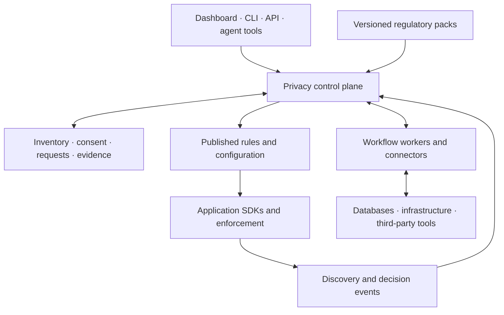
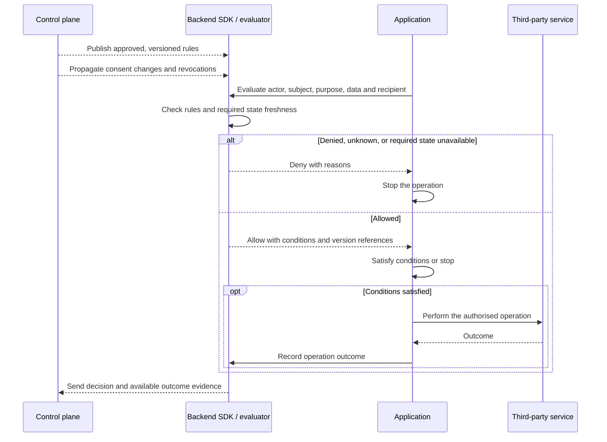
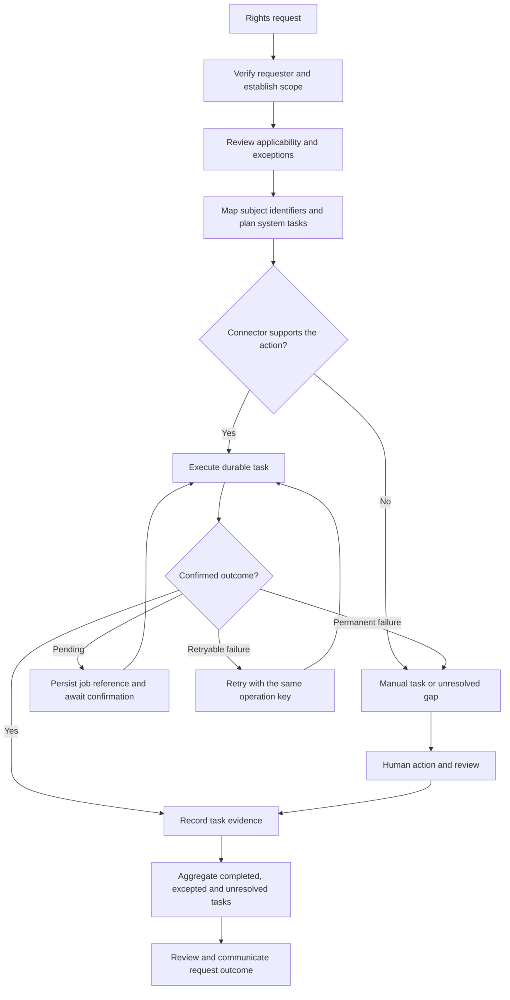

# PolicyStack v2: design decisions

> A working document for deciding what PolicyStack v2 should be. This is a place to frame questions, compare options, and record decisions—not a description of committed functionality.

## Document status

> Record the owner, current phase, last review date, and links to any active proposals.

- **Status:** Exploring
- **Owner:** TBD
- **Last updated:** 6 September 2026
- **Current-state reference:** [`v1.md`](./v1.md)

## Summary

The current direction is an open, self-hostable platform that connects application instrumentation and third-party data flows with global regulatory requirements, consent, authorisation, and data-subject rights. It should support frontend and backend applications across languages, including TypeScript, Python, and Go.

A shared privacy inventory should connect these capabilities: what data exists, whose data it is, where it goes, why it is processed, and which requirements and controls apply. The proposed operating loop is **discover → understand obligations → decide → enforce → fulfil rights → verify**, supported by retention controls, accurate notices, and audit evidence.

The proposed architecture is a central privacy control plane with distributed instrumentation and enforcement, starting with a modular monolith and workflow workers. Product and technical direction remain exploratory, with no committed architecture or delivery plan. Initial integration and jurisdiction coverage, the breadth of authorisation, and the governance of regulatory content remain open.

## Starting point

> Capture the relevant state of v1, what has been learned from building and using it, and any external changes that affect the next version. Link to evidence rather than repeating it here.

## Why v2?

> Explain the problems or opportunities motivating v2, why they matter, and why they cannot be handled adequately through incremental v1 releases.

## Vision and principles

> Define what PolicyStack should become, who it should serve, and the principles that should guide tradeoffs. Note which v1 principles still apply and which need reconsideration.

## Scope

> Describe the intended outcomes and broad capabilities of v2. Record goals, non-goals, product boundaries, and the relationship between the open-source project and any hosted product without assuming a particular implementation.

### Goals

Build the leading open, self-hostable privacy and data-protection platform: simple enough for a hobby project and capable enough for a large, regulated organisation.

1. **Open and sovereign.** Keep all product capabilities open source and self-hostable, with teams in control of their configuration, privacy records, and operational data. Any future hosted offering should run the same software available to users.
2. **End-to-end.** Cover the full privacy lifecycle: discovery, inventory, applicable requirements, policies, consent and preferences, authorisation and enforcement, retention and deletion, data-subject rights, audit evidence, and drift detection.
3. **Language-neutral.** Support polyglot, distributed systems through open schemas and protocols, with idiomatic integrations for languages and frameworks rather than a TypeScript-only model.
4. **Progressively adoptable.** Provide a simple path for small projects and a scalable, governed path for complex and regulated organisations without forcing either experience onto the other.
5. **Verifiable and trustworthy.** Make provenance, uncertainty, rule versions, legal review, human approval, and accepted gaps explicit rather than implying that generated output guarantees compliance.
6. **Extensible.** Enable an open ecosystem of jurisdiction packs, integrations, discovery sources, storage and enforcement adapters, and workflows without requiring every capability to live in the core project.

### Non-goals

### Users and use cases

### Product boundaries

The ambition is awareness of anywhere data goes, including third-party tools and services. Coverage must be explicit: distinguish instrumented and verified flows from declared, inferred, or unknown behaviour. Limited vendor APIs and processing outside instrumented applications must remain visible as gaps.

The proposed initial authorisation scope is privacy decisions, integrating with existing identity and access systems. Whether PolicyStack should also provide general application authorisation remains an open question.

## Design partners and sponsors

> Define how design partners and sponsors will help shape, validate, and sustain v2. Cover the kinds of partners needed, the problems and environments they bring, the working relationship, mutual commitments, and the path from early collaboration to real-world adoption.

### What we need from partners

> Identify the experience, use cases, access, feedback, validation, and other contributions needed to design v2 around real requirements.

### What partners receive

> Clarify the access, influence, support, recognition, and other benefits offered to design partners or sponsors without promising private product capabilities.

### Participation, influence, and transparency

> Decide how partner input affects priorities and decisions while preserving project independence, open development, confidentiality where necessary, and fairness to the wider community.

## Legal, licensing, and governance

> Revisit the legal and organisational foundations of the project before design choices make them difficult to change.

### Does the current licence still hold?

> Assess whether Apache-2.0 still supports the goals and likely shape of PolicyStack v2. Clarify the freedoms and restrictions the project wants, and the practical and community implications of keeping or changing the licence.

### What is covered?

> Clarify how code, generated policy content, documentation, translations, schemas, datasets, extensions, contributions, and hosted services are licensed or otherwise governed.

### Ownership and decision-making

> Decide how intellectual property, contributions, the PolicyStack name, stewardship, and authority over product, technical, legal-content, and release decisions should work.

## Product design

> Describe the experience and capabilities v2 needs before choosing its architecture. For each theme, consider what should remain, change, be added, or be removed relative to v1.

### Policy definition and generation

Connect policy and notice generation to the reviewed inventory, applicable requirements, and implemented controls. Support customisation, human review, versioning, rendering, and publication history. Identify discrepancies when actual processing changes so teams can update notices and controls together.

Generate documents from an approved snapshot of processing activities, dataset flows, recipients, retention rules, and applicable requirements, with reviewed custom text where needed. Link each publication to that snapshot so teams can trace disclosures back to their supporting facts. Compare application declarations and observations against it, exposing new destinations, changed data use, and missing controls as review findings. Development and CI checks should support blocking releases on configured findings; runtime discovery should surface drift within its observed coverage.

#### Policy changes, notifications, and renewed consent

Assess each proposed change against the previous publication and its underlying processing snapshot. Record the affected activities, purposes, recipients, notices, and consent scopes, together with a reviewed response: publication only, user notification, a renewed consent choice, or a combination. A wording-only edit should not automatically invalidate every consent record; changes to processing need their own assessment.

Model document versions separately from the version of processing terms a consent choice covers. Preserve the notice shown when a choice was made, and explicitly determine whether an existing choice remains valid for a proposed processing version. Where a new choice is required, keep the changed processing blocked until that choice is recorded; unaffected processing can continue under its existing controls.

Notifications need audience selection, channel adapters, delivery and retry state, and evidence of which publication was communicated. Notification delivery is not consent. Coordinate policy publication, rule activation, and consent prompts so newly enabled behaviour does not run ahead of the required notice or choice. Effective dates, rollout sequencing, and rollback semantics remain to be designed.

### Privacy inventory and discovery

Maintain a shared model of data categories, data subjects, processing purposes, storage locations, recipients, retention, and flows between systems. Combine frontend and backend instrumentation with infrastructure discovery, third-party integrations, and human declarations.

Preserve provenance and distinguish observed facts, declarations, inferences, and human-reviewed information. Show uncertainty and coverage gaps rather than treating the inventory as automatically complete.

### Consent, authorisation, and enforcement

Track consent and preferences over time, including collection, changes, withdrawal, propagation, and evidence. Provide powerful authorisation that can account for purpose, identity, context, organisational policy, and applicable requirements, with consent as one input to the decision.

Connect decisions to enforcement at collection, access, sharing, exports, and background processing. Define how controls and preference changes reach distributed applications and third parties, and how unsupported enforcement is reported.

Retain cookie consent and headless preferences as explicit product capabilities. Provide guards for cookie and browser-storage access, vendor script loading, library initialisation, and subsequent data-sending calls, with framework bindings over shared semantics. Guarded initialisation should avoid duplicate startup and prevent controlled collection or transmission before the required choice. Server-side operations must enforce their own requirements using trusted consent state.

On withdrawal, stop future guarded operations and invoke supported library or vendor teardown, reset, or opt-out mechanisms. Removing a script element alone cannot undo an initialised library or its prior effects. Integrations must state which lifecycle actions they support; arbitrary uninstrumented library behaviour remains a coverage gap. Consent prompts and guards must also respond to policy changes that require a renewed choice, as described above.

### Retention and deletion

Treat retention and deletion as lifecycle controls that operate independently of user requests. Support schedules, reviewed exceptions, coordinated deletion across connected systems, and evidence of completion. Make incomplete actions and systems that cannot confirm deletion visible.

### Data-subject rights and entitlements

Support data-subject access requests (DSARs) and other applicable user entitlements through operational workflows. Cover requester verification, locating records across applications and vendors, coordinating actions, human review, exceptions, deadlines, and completion evidence.

Identity mapping across systems is a prerequisite for locating relevant records and fulfilling requests accurately. Track partial fulfilment and unresolved dependencies explicitly.

### Legal and jurisdiction coverage

Build a comprehensive database of global data-protection regulations, with explicit coverage and gaps. Connect source material to versioned requirements and applicability rules so teams can understand which obligations apply to a processing activity and what remains unresolved.

Record source provenance, effective dates, reviewed interpretations, and review status. Define how regulatory changes are maintained, legally reviewed, and translated into updates to policies, controls, and workflows. Global coverage is the ambition; initial jurisdictions and the maintenance model remain to be decided.

### Accountability and ongoing assurance

Record decisions, reviews, approvals, exceptions, and evidence. Detect drift between the reviewed inventory and actual behaviour, and identify affected requirements, policies, and controls. For example, a new analytics destination should prompt review of the recipient, purpose, notice, and relevant enforcement.

### User, developer, and agent experience

> Cover the main workflows and interfaces for end users, developers, reviewers, teams, and coding agents, including where human judgement remains necessary.

### Ecosystem and integrations

Support instrumentation across frontend and backend applications, including TypeScript, Python, Go, and other languages, through open contracts and idiomatic integrations.

Treat third-party tools and services as part of the privacy lifecycle wherever they receive, store, or process data. Integrations should expose their supported discovery, consent propagation, enforcement, rights fulfilment, and deletion capabilities, along with limitations and evidence available from the provider.

## Technical design

> Record the technical model only as product requirements become clear. Cover system boundaries, data and trust flows, public contracts, extensibility, packaging, and important alternatives without prematurely fixing the implementation.

See [v2 schema and code examples](./v2-examples.md) for application-model mappings, a customer-data journey, illustrative processing, consent, decision, and connector contracts, frontend and backend code, and deployment and data-model diagrams. These examples explore the proposed design; they do not describe APIs available in v1.

### Concepts and data model

Distinguish the **application's data model** from **PolicyStack's privacy model**, connected through explicit mappings. Applications should keep their existing tables, documents, events, files, and third-party objects. PolicyStack describes their privacy meaning and relationships without requiring a replacement ORM or copying their records into the control plane.

A **processing activity** connects an actor, particular data, a purpose, systems, recipients, and retention rules. It is a central connection point, while datasets, fields, identities, and data flows are first-class entities in their own right.

Discovery supplies evidence about an activity; regulatory rules identify potentially applicable requirements; consent and authorisation govern specific operations; rights and retention workflows act on the data. Each fact needs provenance and review status. An observed outbound request should create a discovery finding rather than automatically becoming an approved processing activity.

#### Application-model mappings

Map datasets and fields to data categories, subject types and identity namespaces, record relationships, and the processing activities that use them. Discover structural information from database schemas, ORM definitions, event schemas, and vendor APIs; let developers and reviewers supply and approve meanings that discovery cannot establish.

Field classification describes what data represents. Purpose, applicability, and consent requirements depend on the operation: an email address does not have one universal purpose or consent requirement. Associating a dataset with several activities does not imply that every field is used by each activity; field-level usage and flow mappings must capture the actual subset.

Rights mappings reference implementations that locate, export, and erase relevant records, including related records where appropriate. A declaration does not establish that these operations are supported or correct. Identity mappings should support resolution inside connectors, using scoped identifiers without centralising every email address or vendor identifier.

#### Privacy domain entities

| Area                      | Core entities                                                                                      | What they establish                                                  |
| ------------------------- | -------------------------------------------------------------------------------------------------- | -------------------------------------------------------------------- |
| Organisation and systems  | Organisation, environment, system, connector installation                                          | Ownership, isolation, and where processing happens                   |
| Data inventory            | Dataset, field, data category, subject type, relationship                                          | What data exists and how records connect                             |
| Processing                | Activity, purpose, data flow, recipient, retention rule                                            | How and why data moves or is used                                    |
| Regulatory knowledge      | Source, requirement version, applicability assessment                                              | Potential obligations and reviewed applicability                     |
| Controls and transparency | Control version, rule bundle, review, publication, notice version, change assessment, notification | What has been approved, what changed, and what has been communicated |
| Identity and choices      | Subject reference, identifier mapping, consent event, preference                                   | Whose data and choices an operation concerns                         |
| Runtime evidence          | Discovery observation, decision, operation outcome                                                 | What was observed, permitted, and performed                          |
| Rights workflows          | Request, verification, system task, exception, evidence                                            | What must happen and what actually completed                         |

A **data flow** connects source and destination datasets, identifies the fields or categories involved, and references the processing activity. Record transformations such as copying, aggregation, and hashing explicitly; describing a transformation does not establish that its output is anonymous. Deletion is a lifecycle operation whose outcome changes what remains in a dataset, with evidence of the affected scope.

#### Persistence and history

The proposed starting point is a relational source of truth with explicit relationships and versioned records. The inventory is logically a graph, but that alone does not require a graph database. This favours referential integrity and transactional updates; graph traversal and high-volume observation workloads need validation before selecting storage technologies.

Keep three distinctions explicit:

- **Observed and approved:** discovery observations remain separate from reviewed inventory, with links showing which evidence supports each version.
- **Historical and current:** consent events and published control versions preserve history; projections provide efficient reads of current state. Decisions reference the versions and state revisions used at evaluation time.
- **Decisions and outcomes:** permission to share or delete remains separate from evidence that the operation happened and the scope confirmed by that evidence.

Scope records and references to the owning organisation and, where relevant, environment and identity namespace. Store schema metadata and scoped identifiers by default, with connector-local resolution for application records. Historical records remain subject to defined retention and access policies; preserving history does not imply retaining personal data indefinitely.

### Architecture and boundaries

The current proposal is a central privacy control plane with instrumentation and enforcement distributed across applications and third-party integrations. Start the control plane as a modular monolith with workers for discovery and long-running workflows. This keeps the initial deployment manageable while leaving room to scale workers and ingestion independently. Implementation language, database, workflow engine, and deployment technologies remain undecided.

#### Control plane and local enforcement

The control plane owns configuration, the privacy inventory, regulatory content, reviews, and evidence. Applications receive versioned rules and configuration, with local evaluation preferred for common backend operations to reduce latency and dependence on central-service availability.

A decision request asks whether an actor may perform an operation on particular data categories, for a purpose, with a given recipient and context. The result should include an allow/deny decision, reasons, and any required conditions. The application must enforce the result and any conditions; evaluating a rule alone does not enforce it. Privacy decisions should compose with existing application access controls, subject to the open question about broader authorisation scope.

Local evaluation introduces consistency tradeoffs for current consent, revocations, and other changing state. Freshness requirements, update propagation, and behaviour when required state is stale or unavailable must be defined before implementation. Frontend controls complement backend enforcement; servers must independently enforce their own operations.

The proposed runtime flow separates asynchronous rule distribution and observation from the operation being authorised. Consent state may be cached or fetched according to the operation's freshness requirements; a rule bundle alone is insufficient.

This example blocks processing when required state is unavailable; the general failure policy remains open. Evidence delivery and retry semantics also need design: a decision, an attempted call, and confirmed downstream processing are different facts.

#### Durable workflows

DSARs, deletion, discovery scans, and regulatory updates need persistent jobs with retries, progress tracking, human review, and evidence. Workers coordinate actions across systems and retain their outcomes. Workflows must distinguish confirmed completion from an attempted action, partial fulfilment, or a manual task awaiting evidence.

Each system task has its own state. Human review can record an exception or unresolved gap without marking data deleted. Request closure and successful fulfilment must remain distinct outcomes.

#### Regulatory knowledge and executable controls

Keep three layers distinct: source material and reviewed interpretations; structured requirements and applicability rules; and executable organisational controls. A regulatory-content update should trigger impact assessment and review before changing production behaviour. Preserve the relationship between the source, interpretation, requirement version, approved control, and resulting decision.

### Public APIs and formats

Define language-neutral, versioned schemas and protocols for processing declarations, consent records, decision requests and results, discovery and decision events, published rules, and connector capabilities. Dashboard, CLI, and agent interfaces should use the same public application APIs.

Provide idiomatic SDKs for TypeScript, Python, Go, and other languages. Separate declaration and observation, consent and preference handling, and decision evaluation and enforcement so teams can adopt them independently. Automatic instrumentation can identify destinations and operations; developers or reviewers still need to supply meaning such as purpose.

Rule semantics must produce consistent decisions across implementations. The evaluation strategy and compatibility rules for evolving contracts remain to be selected and validated.

### Extensibility and integrations

Connectors should advertise specific capabilities such as discovery, record location, export, deletion, and preference propagation, together with their limitations and available completion evidence. Workflow planning should use these capabilities to identify automated actions, manual tasks, and unsupported steps.

Allow connectors and workers to run inside private networks so integrations can reach local systems without requiring those systems to be publicly accessible. Regulatory packs should be versioned inputs to the review and publication process.

### Packages and distribution

For small projects, aim for one self-hosted installation with one database, bundled workers, and an application SDK. Larger deployments should be able to separate workers, scale event ingestion, and place connectors near the systems they access. Both paths should use the same product and contracts; any hosted offering should run the same software.

Package boundaries and infrastructure choices remain open. The modular monolith is the proposed starting point, with deployment separation driven by demonstrated operational needs.

## Trust, quality, and operations

> Define what confidence users need in v2 and how it will be earned. Consider correctness, legal review, security, privacy, accessibility, performance, reliability, observability, testing, and ongoing ownership.

The proposed control plane should primarily hold metadata and evidence, minimising the personal data collected by instrumentation. These records can themselves be sensitive and need appropriate access and retention controls. DSAR exports and other raw personal data should use a separate, tightly controlled storage path with limited retention. Storage location, access boundaries, and evidence retention remain design questions.

## Compatibility and migration

> Decide what compatibility v2 should preserve, what may break, how existing configurations and records are treated, and what migration, coexistence, rollback, and support paths are required.

## Sustainability and commercial model

> Consider how the project will be maintained and funded, including the role of sponsorship and design partnerships. Cover what belongs in public packages or services, what a hosted or commercial offering may provide, and how those choices interact with licensing and community trust.

## Evidence and validation

> Track assumptions, user feedback, repository evidence, legal advice, ecosystem research, prototypes, and experiments needed to make decisions confidently.

### What we know

### Assumptions to test

Use the [customer-data journey](./v2-examples.md#customer-data-journey) to validate relationships and state transitions across collection, vendor sharing, consent withdrawal, and deletion. Check that the model can identify the affected fields and copies, resolve identities locally, reproduce a decision from its referenced versions, and report partial fulfilment without overstating completion.

### Research needed

### Findings

## Risks and open questions

> Keep a concise list of unresolved product, technical, legal, ecosystem, and delivery questions. Give important items an owner and link them to a decision when resolved.

- Which application environments, discovery sources, and third-party integrations should be supported first, and how should coverage be measured?
- How far should authorisation extend beyond privacy decisions, and how should it integrate with existing access-control systems?
- Which jurisdictions should be covered first, and who will maintain, review, and fund regulatory content and applicability rules?
- How should identity mapping work across systems while limiting the personal data PolicyStack itself needs to hold?
- How should enforcement, consent changes, rights requests, and deletion behave when systems are unavailable or vendors expose limited capabilities?
- What evidence is sufficient to mark a flow as verified or an action as complete, and who can approve exceptions and accepted gaps?
- What freshness guarantees do local decisions require for consent and revocations, and what happens when those guarantees cannot be met?
- How should rule evaluation remain consistent across languages, and how should published rules and public contracts evolve compatibly?
- Which deployment and storage boundaries are needed for metadata, evidence, connector credentials, and raw personal data such as DSAR exports?
- How should mappings track application-schema changes, nested fields, multiple subject roles, and derived datasets without losing review history?
- Which inventory queries and observation volumes can the proposed relational model support, and when would additional storage or indexing be justified?

## Delivery

> Once the direction is settled, outline likely workstreams, dependencies, milestones, release criteria, documentation, and communication. Do not treat this section as a commitment until the underlying design decisions are accepted.

## Decision log

> Give durable decisions stable IDs. Retain rejected and superseded decisions so their reasoning is not lost.

| ID    | Decision | Status   | Date | Rationale or link |
| ----- | -------- | -------- | ---- | ----------------- |
| D-001 | TBD      | Proposed | TBD  | TBD               |

## Decision template

### D-XXX: Title

- **Status:** Proposed
- **Date:** TBD
- **Owner:** TBD

#### Context

> What needs to be decided, and why?

#### Options

> What credible alternatives exist?

#### Decision

> What was decided?

#### Consequences

> What becomes easier, harder, possible, or ruled out?

#### Follow-up

> What work or validation is now required?

## References

> Link research, proposals, prototypes, legal advice, and other source material used during the design process.
